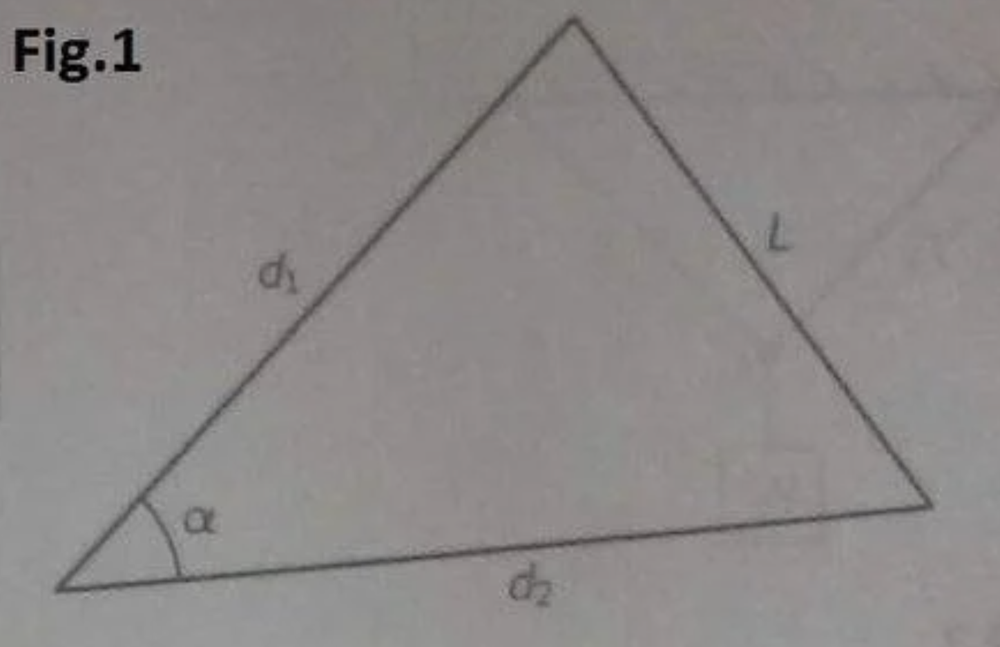

# Exercise 2.4 (a) of Exercises for the Feynman Lectures

*Solution by 0xSigil with help from elius & delta1*

Question:
If the sides $d_1$ and $d_2$ remain fixed in length, but the angle $\alpha$ changes by a small amount $\Delta \alpha$, the opposide side $L$ changes by an amount 

$\Delta L = \frac{d_1 d_1}{L}sin\alpha\Delta\alpha $

Solution:

Looking at the diagram, we can use the Cosine Law

$L^2 = d_1^2 + d_2^2 - 2d_1d_2\cos(\alpha)$

Simplify to:

$L = \sqrt{d_1^2 + d_2^2 - 2d_1d_2\cos(\alpha)}$

Then we partially differentiate (which elius and detla1 taught me over a discord call) and use the chain rule :D

$\frac{dL}{d\alpha} =  \frac{2d_1 d_2 sin \alpha}{2\sqrt{d_1^2 + d_2^2 - 2d_1 d_2 cos \alpha}} $

Since  $L = \sqrt{d_1^2 + d_2^2 - 2d_1d_2\cos(\alpha)}$

$\frac{dL}{d\alpha} =  \frac{2d_1 d_2 sin \alpha}{L} $

Therefore,

$dL =  \frac{2d_1 d_2 sin \alpha{d\alpha}}{L} $